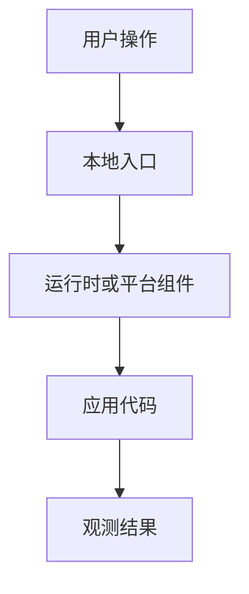

# 新技术学习与复现实验技能

这个技能用来把一个新的技术主题，转化成一套“能运行、能观察、能复现、能继续改造”的学习项目。目标不是只解释概念，而是在当前工作区留下一个真实可操作的案例：用户可以重新运行、查看配置、修改代码、排查问题，并最终上传到代码仓库。

## 核心原则

当这个技能被触发时，按下面的闭环推进：

1. 先阅读当前目录结构，再创建文件。
2. 如果发现同名文件或潜在冲突，先说明处理方式，不要直接覆盖。
3. 基于用户本机环境，选择一个实用且尽量贴近生产的技术架构。
4. 实现一个最小但真实可运行的案例。
5. 为配置文件添加有学习价值的注释。
6. 编写既讲概念又讲操作的文档。
7. 记录实际执行过的命令、执行结果、失败现象、原因分析、修复方式和验证结果。
8. 必须补充一份独立的完整复现指南，让用户不依赖实现过程记录也能从 0 跑起来。
9. 根据风险做相应级别的验证。
10. 最后明确总结创建了什么、如何运行、如何验证、还有什么未完成。

只要用户目标已经清楚，就主动推进。只有当缺失信息会明显改变方案或产物结构时，才停下来询问。

## 工作区规则

- 开始前优先执行 `pwd`、`rg --files`；如果是 Git 仓库，再查看 Git 状态。
- 所有项目产物默认放在当前工作区内，除非用户明确要求放到其他目录。
- 如果已有同名文件，先说明准备合并、跳过、重命名还是备份，再继续。
- 保留用户已有改动，不处理与当前任务无关的脏工作区内容。
- 修改文件时使用 `apply_patch`。
- 不执行破坏性清理命令，除非用户明确授权。

## 技术选型方法

每次做新技术学习实验时，都要形成一份简短但有用的技术选型说明，回答这些问题：

- 为什么这个技术栈适合当前学习目标。
- 对比了哪些合理替代方案。
- 易学性和生产真实性之间有哪些取舍。
- 本地开发和复现路径是什么。
- 如果演进到生产环境，应该如何升级。

如果用户强调“贴近生产”，优先采用这些实践：

- 使用明确版本号，不依赖含糊的 latest 或匿名产物。
- 如果平台支持，增加健康检查、就绪检查或冒烟测试。
- 如果涉及容器，优先使用非 root 运行或最小权限配置。
- 根据场景补充资源限制、超时、重试或失败模式说明。
- 明确区分本地、测试、生产环境的差异。
- 用可复制的命令代替隐式 IDE 操作。

## 默认交付物结构

根据具体技术主题调整名称，但除非用户主动缩小范围，否则应覆盖这些类型的产物：

```text
.
├── 源码或可运行示例
├── 依赖文件或配置文件
├── 运行时、部署或平台配置文件
├── 测试、检查脚本或验证说明
├── docs/
│   ├── 01-技术选型.md
│   ├── 02-实现方案.md
│   ├── 03-核心流程或原理.md
│   ├── 04-操作记录与问题修复.md
│   └── 05-完整复现指南.md
└── README.md
```

如果某类文件对当前技术不适用，要在实现方案或 README 中说明原因。

## 文档约定

### README.md

README 是项目总入口，应包含：

- 这个实验项目演示了什么。
- 架构概览。
- 本地工具要求。
- 从干净仓库开始的快速启动路径。
- 构建、运行、部署命令。
- 验证命令。
- 常见操作。
- 深入文档导航。

### docs/01-技术选型.md

需要包含：

- 为什么最终技术栈适合用户机器和学习目标。
- 至少对比两个合理替代方案；如果没有两个替代方案，要说明原因。
- 每个主要工具或组件在流程中的作用。
- 最终架构，以及面向生产环境的演进路径。

### docs/02-实现方案.md

需要包含：

- 项目目录结构说明。
- 应用或示例设计。
- 运行时、构建或配置设计。
- 部署或执行模型。
- 访问方式。
- 常见生命周期操作，例如启动、停止、更新、回滚、扩缩容、调试；如果领域不同，就替换为该领域的等价操作。
- 查看状态、日志、事件、指标或输出结果的命令。

### docs/03-核心流程或原理.md

用适合学习者理解的语言解释核心运行链路。只要图比文字更清楚，就使用 Mermaid。

示例：



### docs/04-操作记录与问题修复.md

这里记录真实实现过程，不是理想化教程。执行过什么，就记录什么；没有执行过但用于复现的命令，不要伪装成已执行记录。

每个关键步骤使用下面格式：

````md
## 操作步骤 N：步骤名称

### 执行命令

```bash
command here
```

### 命令说明

说明这条命令的作用。

### 执行结果

成功 / 失败。

### 如果失败

错误现象：

报错信息：

原因分析：

修复方式：

验证结果：
````

如果某条命令只是提供给用户后续复现，而不是实现过程中实际执行过，要明确标注为“复现命令”或“建议命令”。

### docs/05-完整复现指南.md

这份文档是学习实验的必需品。它应该让用户从一个刚 clone 下来的项目开始，完整复现运行结果。

必须包含：

1. 进入项目目录。
2. 检查本地工具和版本。
3. 启动必要的本地服务或运行时。
4. 构建项目、安装依赖或准备运行环境。
5. 运行或部署项目。
6. 发起测试请求或执行样例操作。
7. 给出预期输出。
8. 观察日志、状态、管理页面或可视化 UI。
9. 如果技术场景适合，演示更新和回滚。
10. 停止或清理环境。
11. 给出常见本地问题排查表。

命令要具体，预期结果要明确。不要只写“然后测试一下”这种无法复现的描述。

## 实施流程

1. **检查现状**
   - 阅读当前目录结构。
   - 如果是 Git 仓库，查看当前分支和脏工作区。
   - 识别用户机器、操作系统、已有工具和偏好技术栈。

2. **设计方案**
   - 明确最终采用的架构。
   - 第一版实验要足够小，确保能完整交付。
   - 说明与生产环境的差异，但不要为了“像生产”而把本地实验做得过重。

3. **实现案例**
   - 先创建最小可运行应用或示例。
   - 再补充构建、运行、部署或平台配置。
   - 配置文件中的注释要解释关键行为，而不是重复字段名。

4. **整理文档**
   - 概念文档和操作文档同步补齐。
   - 把完整复现指南和历史操作记录分开，避免用户复现时在日志里迷路。

5. **验证结果**
   - 先跑快速本地测试或静态检查。
   - 如果环境支持，再跑真实运行、部署或访问验证。
   - 把遇到的问题和修复过程记录进操作文档。

6. **交付说明**
   - 列出新增或修改的文件。
   - 说明每个核心文件的作用。
   - 给出最短成功运行路径。
   - 给出验证结果。
   - 如有未完成事项，说明原因和后续处理方式。

## 验证清单

在声明完成之前，检查：

- 承诺的文件是否都存在。
- README 是否链接到了完整复现指南。
- 完整复现指南是否能从项目入口开始执行。
- 命令是否尽量使用相对路径，避免写死个人目录。
- 动态端口、动态 URL、动态 ID 没有被当作固定值写死。
- 配置文件是否包含必要且有帮助的注释。
- 测试或冒烟检查是否通过；如果失败，是否记录原因。
- 操作记录是否区分了“实际执行命令”和“复现建议命令”。
- 是否没有误提交本地缓存、IDE 文件、密钥或无关生成物。
- 如果涉及 Git 远端，推送后是否确认本地和远端状态一致。

## 最终回复格式

交付学习实验时，最终回复应包含：

1. 生成或修改了哪些文件。
2. 每个核心文件的作用。
3. 如何启动本地环境。
4. 如何构建或安装依赖。
5. 如何运行或部署。
6. 如何通过请求、日志、状态或 UI 验证。
7. 如何更新、回滚、扩缩容或清理；如果当前技术不适用，要说明。
8. 当前验证结果。
9. 未完成事项；如果有，要说明原因和下一步。

最终回复保持精炼，但要足够可操作，让用户知道下一条命令应该执行什么。

## 示例触发语句

- “我想系统学习 Redis，本地做一个贴近生产的缓存案例。”
- “帮我用 Docker Compose 复现一个 Kafka 入门项目，并写完整复现文档。”
- “我想学习 GitHub Actions，把一个 Python 项目从测试到构建做成完整案例。”
- “把这次学习新技术的流程沉淀成可复用模板。”
